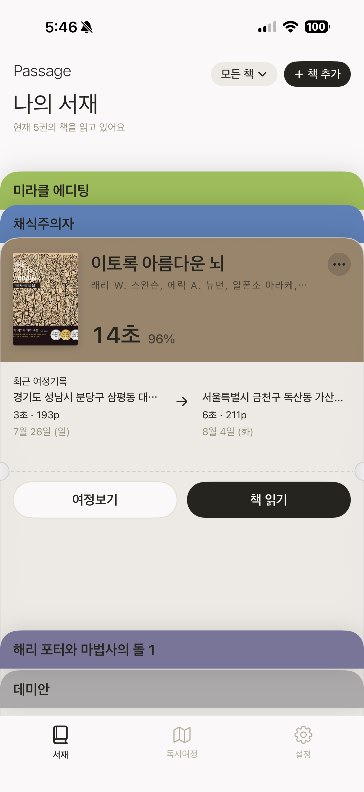

# Passage

독서를 **관리가 아니라 회상**으로 다루는 iOS 앱입니다.
책을 다 읽고 나면 조용히 하나만 묻습니다 — **"어디서 읽으셨나요?"**

  

<sub>서재 — 책마다 한 장의 보딩패스 · 독서 세션 — 시간과 페이지만 남긴다 · 독서여정 — 읽은 장소를 지도로</sub>

연간 목표도, 읽은 권수도, 스트릭도 없습니다.
그 순간의 책·장소·시간·사진이 하나의 **기억**으로 남고, 나중에 책별·장소별로 되돌아봅니다.

> **Memory over Productivity** — 더 많이 읽게 만드는 앱이 아니라, 읽은 순간을 오래 간직하는 앱.

- 플랫폼: iOS 26.5+ · Swift 6 language mode
- 스택: SwiftUI · SwiftData · CloudKit · Observation

## 이 저장소에서 볼 것

코드보다 **설계 기록**이 먼저입니다. 솔로 개발자가 수년간 유지보수한다는 전제로,
단기 구현 속도보다 장기 유지보수성을 우선해 결정을 내리고 그 근거를 남겼습니다.

| 문서 | 내용 |
| --- | --- |
| [Docs/PRD.md](Docs/PRD.md) | 문제 정의, 핵심 개념, MVP 범위와 **명시적 비대상** |
| [Docs/ARCHITECTURE.md](Docs/ARCHITECTURE.md) | 레이어 규칙, 의존성 방향, 폴더 구조 |
| [Docs/DECISIONS.md](Docs/DECISIONS.md) | 설계 결정 29건과 각각의 근거 |
| [Docs/UI_GUIDE.md](Docs/UI_GUIDE.md) | 톤·타이포·컴포넌트 규칙 |
| [Docs/ROADMAP.md](Docs/ROADMAP.md) | 마일스톤 |

## 설계에서 신경 쓴 것

**1. Session is Source of Truth — 파생 데이터를 저장하지 않는다**
`ReadingSession`(시작~종료 시각, 책, 장소, 페이지)이 유일한 원자 단위입니다.
"이 책을 총 몇 시간 읽었나" 같은 통계는 **저장하지 않고 세션에서 계산**합니다.
집계 필드를 두면 반드시 실제 데이터와 어긋나는 순간이 오기 때문입니다.
`Memory`도 별도 엔티티가 아니라 세션에서 파생됩니다.

**2. 의존성은 한 방향으로만**
```
View → Store(@Observable, @MainActor) → Service(protocol) → Persistence / Network
```
아래 레이어는 위를 모릅니다. 외부 시스템(지도·책 검색·이미지·위치·인증)은 전부
protocol로 감싸 교체와 테스트가 가능하게 했습니다.
실제로 책 검색은 `BookSearchService` 프로토콜 아래 Naver와 Google Books
두 구현이 공존합니다.

**3. Repository 패턴을 일부러 쓰지 않았다**
SwiftData의 `@Query`와 `ModelContext`가 이미 그 역할을 합니다.
그 위에 Repository를 한 겹 더 얹으면 프레임워크와 싸우게 되고,
`@Query`의 자동 갱신 같은 이점을 잃습니다.
**추상화는 이득이 분명할 때만 넣는다**는 원칙에 따라 뺐습니다. (DECISIONS #6)

**4. 스키마 버저닝을 1일차에 넣었다가 되돌렸다**
`VersionedSchema` + `MigrationPlan`을 1일차에 도입했지만(#12), **버전마다 모델 스냅샷을 두지 않고
`SchemaV1/V2/V3`가 모두 같은 `Book` 클래스를 가리켰습니다.** 세 버전의 체크섬이 같아지고,
기존 스토어가 있는 기기에서 `Duplicate version checksums` 런치 크래시가 났습니다.
개발 중에는 스토어를 초기화하며 쓰느라 드러나지 않다가 **실제 테스터 기기에서 처음 터졌습니다.**

지금은 `migrationPlan`을 지정하지 않고 SwiftData의 **자동 lightweight 마이그레이션**에 맡깁니다.
앱이 미출시이고 지금까지의 스키마 변경이 전부 additive(옵셔널 필드 추가)라 성립하는 선택입니다.
비-additive 변경이나 출시 후 버전 간 마이그레이션이 필요해지는 시점에,
**버전별 모델 스냅샷을 제대로 갖춘** `VersionedSchema`로 다시 들어갑니다 — 재도입 조건을 결정에 적어두었습니다.
(DECISIONS [#12](Docs/DECISIONS.md) → [#22](Docs/DECISIONS.md))

**5. Swift 6 + MainActor 기본 격리**
동시성 경고를 나중에 몰아서 처리하지 않도록 처음부터 Swift 6 language mode로 시작했습니다.

## 구조

```
passage/
├── App/                PassageApp · RootView · AppDependencies(서비스 컨테이너)
├── Core/
│   ├── Models/         Book · Place · ReadingSession · Quote · PageRules
│   ├── Services/       BookSearch · Naver 지도 · Location · ImageStore · Auth
│   ├── Persistence/    ModelContainer 구성
│   └── DesignSystem/   Theme · BookCoverView · StoredImageView
└── Features/
    ├── Library/        책 목록과 책별 통계
    ├── Reading/        세션 시작·종료 컨트롤러
    ├── Place/          "어디서 읽으셨나요?" 흐름
    ├── Journal/        기억 회상 화면
    ├── Reflection/     독서 후 남기는 소회 정리
    └── Settings/
```

기능은 자기 폴더 안에서 완결됩니다. Feature 간 직접 의존은 금지하고, 공용만 `Core/`에 둡니다.

## 테스트

`passageTests/`에 16개 테스트 파일이 있습니다. 도메인 규칙(`PageRulesTests`,
`ReadingSessionTests`), 파생 계산(`MemoryOrganizerTests`, `ReflectionOrganizerTests`,
`PageCountTests`), 외부 경계(`NaverBookSearchTests`, `PlaceSearchTests`)를 나눠 검증합니다.

Service를 protocol로 감싼 덕분에 책 검색·장소 검색 테스트가 네트워크 없이 돌아갑니다.
"Session is Source of Truth" 원칙도 테스트로 고정해두어, 집계 필드를 저장하는
변경이 들어오면 깨지도록 했습니다.

## 실행 방법

```bash
git clone https://github.com/JuseongMoon/passage.git
cd passage
open passage.xcodeproj
```

책 검색과 지도를 쓰려면 네이버 개발자센터에서 키를 발급받아
`passage/App/Config/Secrets.xcconfig`에 넣습니다. 이 파일은 커밋되지 않습니다.
(`Secrets.xcconfig.example`을 복사해서 사용)

## 라이선스

MIT License. 자세한 내용은 [LICENSE](LICENSE)를 참고하세요.
